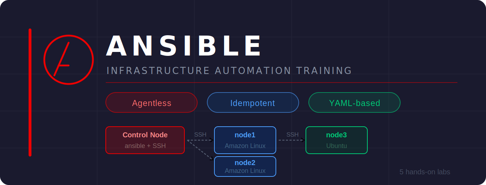

<div align="center">

# 🔧 Ansible Training

**Hands-on labs covering Ansible from zero to production-ready automation.**


</div>

---

## 📋 Table of Contents

- [What is Ansible?](#-what-is-ansible)
- [How Ansible Works](#-how-ansible-works)
- [Prerequisites](#-prerequisites)
- [Getting Started](#-getting-started)
- [Repository Structure](#-repository-structure)
- [Quick Reference](#-quick-reference)
- [Learning Path](#-learning-path)
- [Reference Links](#-reference-links)

---

## 📌 What is Ansible?

**Ansible** is an open-source IT automation tool that lets you configure systems, deploy software, and orchestrate infrastructure — all without installing any agent on your servers. It connects over plain **SSH** and uses human-readable **YAML** files called _playbooks_.

> **Why Ansible?**  
> ✅ Agentless — no extra software on managed nodes  
> ✅ Idempotent — run it 10 times, result is always the same  
> ✅ 3000+ built-in modules (yum, apt, copy, service, user, aws_ec2 ...)  
> ✅ Human-readable YAML — no programming background required

---

## 🏗 How Ansible Works

```
                  ╔════════════════════════════════════════════════════════════╗
                  ║                        CONTROL NODE                        ║
                  ║                                                            ║
                  ║   ┌─────────────┐   ┌─────────────┐   ┌─────────────────┐  ║
                  ║   │ inventory   │   │ ansible.cfg │   │   playbook.yml  │  ║
                  ║   │             │   │             │   │                 │  ║
                  ║   │ [webservers]│   │ [defaults]  │   │ - name: Install │  ║
                  ║   │ node1       │   │ inventory=  │   │   hosts: all    │  ║
                  ║   │ node2       │   │ host_key_   │   │   tasks: ...    │  ║
                  ║   │             │   │  checking=F │   │                 │  ║
                  ║   └─────────────┘   └─────────────┘   └─────────────────┘  ║
                  ║                            │                               ║
                  ╚════════════════════════════╪═══════════════════════════════╝
                                               │  SSH (port 22) — no agent!
                            ┌──────────────────┼──────────────────┐
                            │                  │                  │
                            ▼                  ▼                  ▼
                    ┌───────────────┐  ┌───────────────┐  ┌───────────────┐
                    │    node1      │  │    node2      │  │    node3      │
                    │               │  │               │  │               │
                    │ Amazon Linux  │  │ Amazon Linux  │  │    Ubuntu     │
                    │   ec2-user    │  │   ec2-user    │  │    ubuntu     │
                    │   :22  :80    │  │   :22  :80    │  │   :22  :80    │
                    └───────────────┘  └───────────────┘  └───────────────┘
```

### Push-based Model

```
ansible-playbook site.yml
        │
        │  1. Read inventory  →  find target hosts
        │  2. Read ansible.cfg  →  apply defaults
        │  3. SSH into each host
        │  4. Upload & execute Python modules
        │  5. Collect results  →  report back
        ▼
  ✅ CHANGED   →  task ran, something changed
  ✅ OK        →  task ran, nothing needed to change  (idempotent)
  ❌ FAILED    →  task ran, something went wrong
  ⚠️  SKIPPED  →  task skipped (when condition = false)
```

---

## 🛠 Prerequisites

### Required

| Requirement  | Detail                                          |
| ------------ | ----------------------------------------------- |
| AWS Account  | EC2 instances to use as control & managed nodes |
| SSH Key Pair | `.pem` file to authenticate to EC2 instances    |
| Python 3.x   | Already available on Amazon Linux 2023 & Ubuntu |
| Basic Linux  | `cd`, `ls`, `cat`, `echo`, `sudo` comfort level |

### EC2 Setup

Spin up **3 Amazon Linux 2023** instances (+ optionally 1 Ubuntu):

```
                  ┌───────────────────────────────────────────────────────────────┐
                  │    Instance   |         AMI        |  Ports  |    SSH User    │
                  ├───────────────────────────────────────────────────────────────┤
                  │  control node   Amazon Linux 2023     22        ec2-user      │
                  │  node1          Amazon Linux 2023     22, 80    ec2-user      │
                  │  node2          Amazon Linux 2023     22, 80    ec2-user      │
                  │  node3          Ubuntu 22.04 LTS      22, 80    ubuntu        │
                  └───────────────────────────────────────────────────────────────┘
```

---

## 🚀 Getting Started

### 1 — Install Ansible on Control Node

```bash
sudo dnf update -y
sudo dnf install ansible -y

# Verify
ansible --version
```

### 2 — Copy your .pem key to Control Node

```bash
# Run this on your LOCAL machine
scp -i <key.pem> <key.pem> ec2-user@<control-node-ip>:/home/ec2-user
```

### 3 — Create project folder

```bash
mkdir ansible_lesson1 && cd ansible_lesson1
```

### 4 — Create inventory.txt

```ini
[webservers]
node1 ansible_host=<node1_ip>  ansible_user=ec2-user
node2 ansible_host=<node2_ip>  ansible_user=ec2-user

[ubuntuserver]
node3 ansible_host=<node3_ip>  ansible_user=ubuntu

[all:vars]
ansible_ssh_private_key_file=/home/ec2-user/<key.pem>
```

### 5 — Create ansible.cfg

```ini
[defaults]
host_key_checking  = False
inventory          = inventory.txt
interpreter_python = auto_silent
```

### 6 — Verify everything works

```bash
ansible-inventory --list      # confirm hosts are parsed correctly
ansible all --list-hosts      # list matched hosts
ansible all -m ping           # test SSH + Python on all nodes
```

Expected output:

```
node1 | SUCCESS => { "ping": "pong" }
node2 | SUCCESS => { "ping": "pong" }
node3 | SUCCESS => { "ping": "pong" }
```

---

## 📂 Repository Structure

| #   | Folder                                                                                                                                               | Topics Covered                                                                                 |
| --- | ---------------------------------------------------------------------------------------------------------------------------------------------------- | ---------------------------------------------------------------------------------------------- |
| 01  | [`ansible-01-using-modules-with-ad-hoc-commands`](./ansible-01-using-modules-with-ad-hoc-commands)                                                   | Installation · Inventory · ansible.cfg · Ad-hoc commands · ping · copy · shell · yum · package |
| 02  | [`ansible-02-using-playbook-with-task`](./ansible-02-using-playbook-with-task)                                                                       | Playbook structure · Tasks · Handlers · notify · when · loops                                  |
| 03  | [`ansible-03-facts-vars-and-using-secrets-working-with-dynamic-inventory`](./ansible-03-facts-vars-and-using-secrets-working-with-dynamic-inventory) | Gather facts · Variables · Vault (secrets) · Dynamic inventory                                 |
| 04  | [`ansible-04-directory-layout-starategy-errors`](./ansible-04-directory-layout-starategy-errors)                                                     | Best practice layout · Error handling · ignore_errors · block/rescue                           |
| 05  | [`ansible-05-using-roles-and-ansible-galaxy`](./ansible-05-using-roles-and-ansible-galaxy)                                                           | Roles · ansible-galaxy · Reusable automation · Community roles                                 |
| 06  | [`ansible-06-templates-tags-and-debugging`](./ansible-06-templates-tags-and-debugging)                                                               | Jinja2 templates · Variable precedence · Tags · include/import · Debugging · Testing           |

---

## ⚡ Quick Reference

### Ad-hoc Commands

```bash
ansible all -m ping                                                  # connection test
ansible all -a "uptime"                                              # run a shell command
ansible webservers -m copy -a "src=app.conf dest=/etc/app.conf"      # copy a file
ansible all -b -m package -a "name=nginx state=present"              # install a package
ansible all -b -m service -a "name=nginx state=started enabled=yes"  # manage a service
```

### Playbook

```yaml
---
- name: Configure web servers
  hosts: webservers
  become: true

  tasks:
    - name: Install nginx
      package:
        name: nginx
        state: present

    - name: Start and enable nginx
      service:
        name: nginx
        state: started
        enabled: true

    - name: Deploy config
      copy:
        src: files/nginx.conf
        dest: /etc/nginx/nginx.conf
      notify: Restart nginx

  handlers:
    - name: Restart nginx
      service:
        name: nginx
        state: restarted
```

```bash
ansible-playbook site.yml               # run
ansible-playbook site.yml --check       # dry-run (no changes made)
ansible-playbook site.yml --tags "install"
```

### Variables & Facts

```yaml
vars:
  app_port: 8080

tasks:
  - name: Show OS info
    debug:
      msg: "{{ ansible_distribution }} {{ ansible_distribution_version }}"

  - name: Install on RedHat only
    yum:
      name: httpd
      state: present
    when: ansible_os_family == "RedHat"
```

### Vault

```bash
ansible-vault create secrets.yml           # create encrypted file
ansible-vault encrypt vars.yml             # encrypt existing file
ansible-playbook site.yml --ask-vault-pass
```

### Roles

```
roles/
└── nginx/
    ├── tasks/main.yml       ← what to do
    ├── handlers/main.yml    ← reactions (restart etc.)
    ├── templates/*.j2       ← Jinja2 config templates
    ├── files/               ← static files
    └── defaults/main.yml    ← default variables
```

```bash
ansible-galaxy install geerlingguy.nginx   # install community role
ansible-galaxy init my_role                # scaffold a new role
```

---

## 🗺️ Learning Path

```
                    ┌──────────────────────────────────────────────────────────┐
                    │                                                          │
                    │  [01] Ad-hoc Commands                                    │
                    │        ping · copy · shell · yum · package               │
                    │                          │                               │
                    │                          ▼                               │
                    │  [02] Playbooks & Tasks                                  │
                    │        tasks · handlers · notify · loops                 │
                    │                          │                               │
                    │                          ▼                               │
                    │  [03] Facts · Variables · Vault · Dynamic Inventory      │
                    │        ansible_facts · group_vars · host_vars            │
                    │                          │                               │
                    │                          ▼                               │
                    │  [04] Directory Layout · Error Handling                  │
                    │        block · rescue · ignore_errors                    │
                    │                          │                               │
                    │                          ▼                               │
                    │  [05] Roles · Ansible Galaxy                             │
                    │        reusable · community roles                        │
                    │                                                          │
                    └──────────────────────────────────────────────────────────┘
```

---

## 📚 Reference Links

| Resource               | Link                                                                                                       |
| ---------------------- | ---------------------------------------------------------------------------------------------------------- |
| Official Documentation | [docs.ansible.com](https://docs.ansible.com)                                                               |
| Module Index           | [docs.ansible.com/.../index_module](https://docs.ansible.com/ansible/latest/collections/index_module.html) |
| Ansible Galaxy         | [galaxy.ansible.com](https://galaxy.ansible.com)                                                           |
| Best Practices         | [Tips & Tricks](https://docs.ansible.com/ansible/latest/tips_tricks/ansible_tips_tricks.html)              |
| Jinja2 Templates       | [jinja.palletsprojects.com](https://jinja.palletsprojects.com/en/3.1.x/)                                   |
| YAML Syntax            | [yaml.org](https://yaml.org/spec/1.2.2/)                                                                   |

---

<div align="center">

_Happy Automating!_ 🚀

</div>
